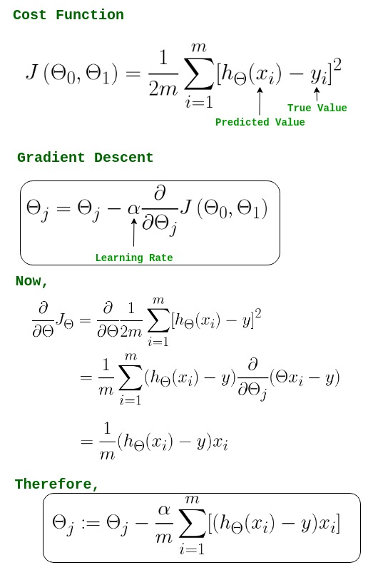

## Introduction

This post explores how neural networks learn representations...

## Word Embeddings

Word embeddings are a way to represent words as vectors...

### Visualizing Embeddings

Here's how we can visualize word embeddings:

## Conclusion

Neural networks learn powerful representations automatically.
